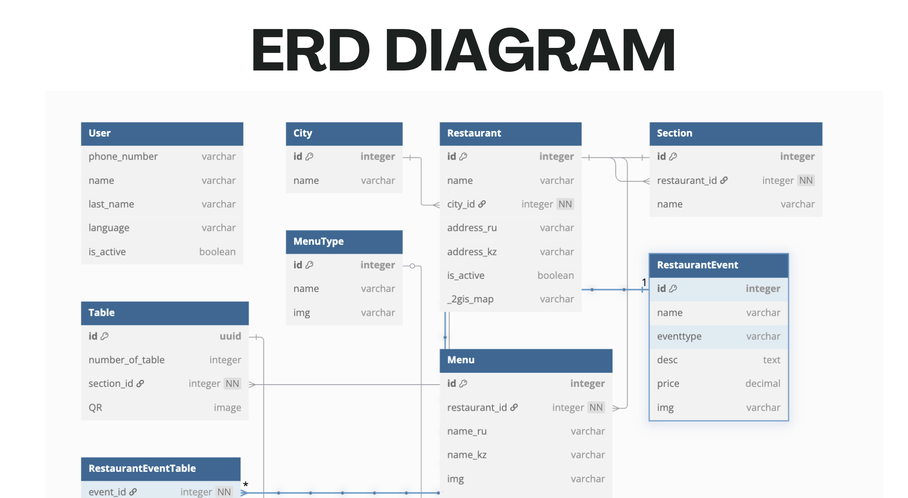

# Restaurant Management System

## Project Overview
This is my Go project for the programming language course. It's a restaurant management system backend that handles restaurants, tables, menus, events, and users.

The system lets restaurant managers add their restaurants to the platform, create sections inside each restaurant, add tables with QR codes, and manage special events. Users can view restaurant info and book tables for events.

## ERD Diagram

## 📊 Presentation
You can view my presentation [here](./docs/GO.pdf).

## Tech Stack
- Golang with Echo framework for REST API
- PostgreSQL for database
- Swagger for API documentation
- Docker & Docker Compose for containerization
- JWT for authentication

## Main Features
- Restaurant management (add, edit, delete restaurants)
- Table management with QR code generation
- Menu management with multi-language support (Russian/Kazakh)
- Event management and table booking for events
- User registration and authentication

## How to Run
Check the docker-compose.yml file to run the project with all dependencies.